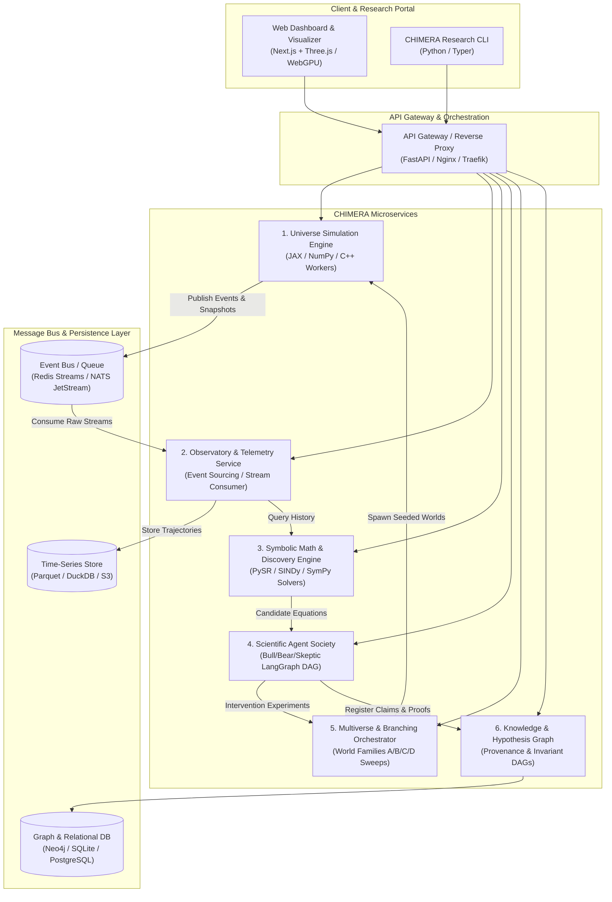

# CHIMERA: Phase-Wise Implementation & Microservice Architecture

> **Artificial Multiverse Scientific Observatory**  
> *A decoupled, scalable platform where deterministic numerical universes evolve, an event-sourced observatory captures complete histories, and adversarial AI scientific agents discover, challenge, and validate governing laws.*

---

## Table of Contents
1. [Core Architectural Principle](#1-core-architectural-principle)
2. [Microservice System Architecture](#2-microservice-system-architecture)
   - [Service Decomposition & Responsibilities](#service-decomposition--responsibilities)
   - [Service Communication & Event Bus](#service-communication--event-bus)
   - [Data Storage Tier](#data-storage-tier)
3. [Phase-Wise Implementation Roadmap (v0.1 → v1.0)](#3-phase-wise-implementation-roadmap-v01--v10)
   - [Phase 0: Governance & Scaffolding](#phase-0-governance--scaffolding)
   - [Phase 1: Deterministic Engine & Numerical Physics (v0.1)](#phase-1-deterministic-engine--numerical-physics-v01)
   - [Phase 2: Event-Sourced Observatory & Data Layer (v0.2a)](#phase-2-event-sourced-observatory--data-layer-v02a)
   - [Phase 3: Hidden-Law Benchmark & Symbolic Engine (v0.2b)](#phase-3-hidden-law-benchmark--symbolic-engine-v02b)
   - [Phase 4: Adversarial Scientific Society & Experiment Engine (v0.3)](#phase-4-adversarial-scientific-society--experiment-engine-v03)
   - [Phase 5: Multiverse Engine & Cross-World Discovery (v0.4–v0.5)](#phase-5-multiverse-engine--cross-world-discovery-v04v05)
   - [Phase 6: Reaction-Network Chemistry (v0.6)](#phase-6-reaction-network-chemistry-v06)
   - [Phase 7: Artificial Life & Evolutionary Dynamics (v0.7–v0.8)](#phase-7-artificial-life--evolutionary-dynamics-v07v08)
   - [Phase 8: Embodied Intelligence & Emergence (v0.9)](#phase-8-embodied-intelligence--emergence-v09)
   - [Phase 9: Scientific Civilizations & Observer Experiments (v1.0)](#phase-9-scientific-civilizations--observer-experiments-v10)
4. [Multi-Agent Engineering Division of Labor](#4-multi-agent-engineering-division-of-labor)
5. [Cost-to-Output Optimization Strategy](#5-cost-to-output-optimization-strategy)
6. [Definition of Done](#6-definition-of-done)

---

## 1. Core Architectural Principle

```
                            CHIMERA SYSTEM
                                   │
              ┌────────────────────┴────────────────────┐
              ▼                                         ▼
   DETERMINISTIC SIMULATION                     AI SCIENTISTS
   • Vectorized Numerical Solvers              • Hypothesis Formulation
   • Deterministic Physics/Chemistry           • Adversarial Debate (Bull/Bear/Skeptic)
   • Exact Seed & Trajectory History           • Counterfactual Experiment Design
   • Independent of LLM (Zero Hallucination)   • Mathematical Intuition & Synthesis
              │                                         │
              └────────────────────┬────────────────────┘
                                   ▼
                         UNIVERSAL OBSERVATORY
                        (Event-Sourced Truth)
```

* **The LLM is NEVER the simulator.** The simulation runs strictly on verified, deterministic numerical engines (NumPy, JAX, SciPy, C++).
* **AI Scientists only see observations.** Underlying governing equations are completely withheld to benchmark true empirical discovery.
* **Full Provenance**: Every discovery links directly to exact world seeds, trajectory snapshots, and counterfactual interventions.

---

## 2. Microservice System Architecture

The CHIMERA platform is designed as a distributed, decoupled microservice ecosystem. It operates seamlessly in a lightweight local container environment (`docker-compose`) and scales out horizontally to distributed clusters.



---

### Service Decomposition & Responsibilities

#### 1. Universe Simulation Service (`chimera-sim-engine`)
* **Role**: Deterministic world state evolution.
* **Technology**: Python (JAX/NumPy) with optional C++/Rust integration kernels.
* **Protocol**: gRPC for high-throughput step commands; publishes binary state delta frames to Event Bus.
* **Capabilities**:
  * Step-level numerical integration (RK4, Verlet, Symplectic).
  * Particle kinematics, force fields, boundary collisions.
  * Deterministic state restoration from exact `(world_id, seed, tick_index)`.

#### 2. Observatory & Telemetry Service (`chimera-observatory`)
* **Role**: Universal recorder, telemetry aggregator, and feature extraction.
* **Technology**: Python / DuckDB / Apache Arrow / Parquet.
* **Capabilities**:
  * Event ingestion (`PARTICLE_CREATED`, `COLLISION`, `ENERGY_MEASURED`, `PHASE_TRANSITION`).
  * Time-series snapshot compression and storage in columnar format.
  * Real-time derived metric computation (entropy, kinetic/potential energy, density gradients).
  * Filtered observation feeds for AI scientists (withholding hidden variables).

#### 3. Symbolic Math & Discovery Service (`chimera-math-engine`)
* **Role**: Local, zero-token mathematical fitting and equation discovery.
* **Technology**: SINDy (`PySINDy`), PySR (Symbolic Regression via Julia/Python), SymPy, SciPy.
* **Capabilities**:
  * Sparse identification of non-linear dynamics from time-series trajectories.
  * Dimensional analysis and invariant verification (conservation laws).
  * Parameter estimation, confidence intervals, and residual error computations.

#### 4. Scientific Agent Society (`chimera-agent-society`)
* **Role**: Adversarial reasoning, hypothesis synthesis, and experiment proposal.
* **Technology**: LangGraph / Explicit State Machine + Structured LLM APIs.
* **Agents**:
  * **Physicist / Chemist / Biologist**: Domain-specific priors and qualitative interpretation.
  * **Bull**: Formulates the strongest evidence-backed defense for a theory.
  * **Bear**: Identifies alternative explanations, hidden confounders, and edge cases.
  * **Skeptic**: Generates counterfactual experiments designed specifically to break/falsify the hypothesis.
  * **Arbiter**: Quantitative scoring of reproducibility, Bayesian evidence, and predictive success.

#### 5. Multiverse & Branching Orchestrator (`chimera-multiverse`)
* **Role**: Multi-world lifecycle, parameter sweeps, and counterfactual interventions.
* **Technology**: Ray / Celery / Python AsyncIO.
* **Capabilities**:
  * Parallel world execution across World Families (A: Initial conditions, B: Chaos/Lyapunov, C: Parameter sweeps, D: Checkpoint branching).
  * Controlled perturbation injection (interventions on mass, velocity, force constants).
  * Cross-world trajectory alignment and divergence detection.

#### 6. Knowledge & Hypothesis Graph Service (`chimera-knowledge-graph`)
* **Role**: Permanent scientific memory, hypothesis lifecycle, and theorem provenance.
* **Technology**: NetworkX (local) $\rightarrow$ Neo4j / PostgreSQL.
* **Capabilities**:
  * Hypothesis DAG: $\text{Observation} \rightarrow \text{Candidate Equation} \rightarrow \text{Bull/Bear Arguments} \rightarrow \text{Falsification Test} \rightarrow \text{Verdict}$.
  * Cross-world invariant registry.
  * Preservation of failed experiments to prevent circular reasoning.

#### 7. Web & Visualizer Gateway (`chimera-web-portal`)
* **Role**: Interactive scientific exploration and real-time observability.
* **Technology**: Next.js, Three.js, WebGPU, TailwindCSS.
* **Capabilities**:
  * Interactive timeline scrubber with sub-frame inspection.
  * Multiverse branching tree and divergence visualizer.
  * Live Hypothesis Debate Arena (Bull vs. Bear vs. Skeptic).
  * Equation discovery laboratory and trajectory overlay plots.

---

### Data Storage Tier

| Layer | Local Development | Cloud / Production Scale | Data Stored |
|---|---|---|---|
| **Event Stream** | Redis Streams / In-Memory Queue | NATS JetStream / Kafka | High-frequency simulation events & state deltas |
| **Trajectory Snapshots** | Local DuckDB + Parquet Files | MinIO / AWS S3 + DuckDB | Vectorized particle histories, field matrices |
| **Hypothesis & Provenance** | SQLite + NetworkX | PostgreSQL + Neo4j | Hypotheses, scientific debates, evidence links |
| **World Configurations** | Versioned YAML / JSON in Git | PostgreSQL Config Store | Simulation seeds, force laws, parameter sweeps |

---

## 3. Phase-Wise Implementation Roadmap (v0.1 → v1.0)

```text
DETERMINISTIC UNIVERSE (v0.1)
        ↓
OBSERVATORY & TIME-SERIES (v0.2a)
        ↓
HIDDEN-LAW BENCHMARK (v0.2b)
        ↓
ADVERSARIAL AGENT SOCIETY (v0.3)
        ↓
MULTIVERSE & EXPERIMENT ENGINE (v0.4)
        ↓
CROSS-WORLD INVARIANTS (v0.5)
        ↓
REACTION-NETWORK CHEMISTRY (v0.6)
        ↓
ARTIFICIAL LIFE (v0.7)
        ↓
EVOLUTIONARY DYNAMICS (v0.8)
        ↓
EMBODIED INTELLIGENCE (v0.9)
        ↓
SCIENTIFIC CIVILIZATION (v1.0)
```

---

### Phase 0: Governance & Scaffolding
* **Objective**: Establish monorepo structure, development rules, reproducibility guarantees, and service contracts.
* **Key Deliverables**:
  * Monorepo directory setup (`packages/`, `apps/`, `experiments/`, `configs/`).
  * `AGENTS.md` (defining multi-agent boundaries, forbidden patterns, seed rules).
  * Base docker-compose configuration for local service orchestration.
* **Exit Criteria**: All microservice interfaces defined with typed Pydantic schemas.

---

### Phase 1: Deterministic Engine & Numerical Physics (`CHIMERA 0.1`)
* **Objective**: Build the smallest deterministic universe with exact numerical reproducibility.
* **Key Deliverables**:
  * `WorldState` model (immutable state container: time, particles, forces, parameters, random state).
  * High-precision numerical integrators (RK4, Symplectic Verlet).
  * 2D particle dynamics with gravity-like interactions and elastic boundary collisions.
  * Exact seed guarantee: $\text{Seed} + \text{Config} + \text{Code Hash} \implies \text{Bitwise Identical Trajectory}$.
* **Cost Optimization**: 100% vectorized NumPy/JAX. $0 LLM token cost.
* **Exit Criteria**: Passes 100 consecutive reproducibility tests and energy conservation benchmarks.

---

### Phase 2: Event-Sourced Observatory & Data Layer (`CHIMERA 0.2a`)
* **Objective**: Build the universal observation pipeline that records universe history without leaking underlying rules.
* **Key Deliverables**:
  * Event-sourced logging pipeline (`PARTICLE_CREATED`, `COLLISION`, `ENERGY_MEASURED`).
  * Parquet/DuckDB time-series storage engine for fast trajectory slicing.
  * Feature extraction engine (kinetic/potential energy, velocity distributions, spatial entropy).
  * Three.js/WebGPU timeline visualizer with frame scrubbing.
* **Exit Criteria**: Can record and replay 100,000 steps of multi-particle interaction with $< 50\text{ms}$ query latency.

---

### Phase 3: Hidden-Law Benchmark & Symbolic Engine (`CHIMERA 0.2b`)
* **Objective**: The Blind Universe Challenge — recover hidden governing equations from observations alone.
* **Key Deliverables**:
  * Benchmark testbed with withheld ODEs (e.g., Harmonic oscillator, Keplerian orbit, damped collision).
  * Integration of local symbolic solvers (PySR, SINDy, SymPy) to identify candidate equations for $0 tokens.
  * Structured `Hypothesis` data model (formal equation, confidence score, evidence citations).
* **Exit Criteria**: AI recovers hidden ODE parameter values with $< 1\%$ error and predicts unseen trajectories with $R^2 > 0.99$.

---

### Phase 4: Adversarial Scientific Society & Experiment Engine (`CHIMERA 0.3`)
* **Objective**: Automated hypothesis debate, falsification, and counterfactual testing.
* **Key Deliverables**:
  * **Bull / Bear / Skeptic / Arbiter** LangGraph state machine.
  * **Intervention Engine**: Generates targeted perturbation experiments to falsify hypotheses.
  * **Hypothesis Graph**: Live DAG connecting claims to empirical data and counter-arguments.
* **Cost Optimization**: Single-pass structured JSON agent rounds; no open-ended multi-agent chat loops.
* **Exit Criteria**: System rejects deliberately attractive but false hypotheses via counterfactual testing.

---

### Phase 5: Multiverse Engine & Cross-World Discovery (`CHIMERA 0.4` – `0.5`)
* **Objective**: Parallel world execution, Lyapunov chaos analysis, and invariant detection.
* **Key Deliverables**:
  * Multiverse Orchestrator running World Families:
    * **Family A**: Identical laws, varying seeds/initial conditions.
    * **Family B**: Chaos testing (micro-perturbations to calculate Lyapunov exponents).
    * **Family C**: Systematic law sweeps (phase transition identification).
    * **Family D**: Branching worlds from checkpoints.
  * **Cross-World Invariant Detector**: Distinguishes universal laws from historical coincidences.
* **Exit Criteria**: System identifies energy conservation across 500 varied worlds while isolating seed-contingent artifacts.

---

### Phase 6: Reaction-Network Chemistry (`CHIMERA 0.6`)
* **Objective**: Emergent chemistry, kinetics, and autocatalysis.
* **Key Deliverables**:
  * Mass-action kinetics solver ($dX/dt = S \cdot v(X, k)$).
  * Hypergraph representation of chemical species and reaction cascades.
  * Detection of emergent chemical oscillators (e.g., Brusselator dynamics) and autocatalytic cycles.
  * Chemist Agent for reaction stoichiometry analysis.
* **Exit Criteria**: Autonomous detection of self-sustaining autocatalytic cycles in simulated reaction networks.

---

### Phase 7: Artificial Life & Evolutionary Dynamics (`CHIMERA 0.7` – `0.8`)
* **Objective**: Self-replicating agents, genomes, natural selection, and speciation.
* **Key Deliverables**:
  * Cellular organisms with internal metabolism, energy budgets, reproduction, and mutation.
  * Evolutionary engines tracking fitness landscapes, phylogenetic lineage trees, and extinction events.
  * Biologist Agent analyzing convergent evolution across parallel worlds.
* **Exit Criteria**: Replicating artificial organisms evolve distinct survival strategies under resource scarcity across separate world runs.

---

### Phase 8: Embodied Intelligence & Emergence (`CHIMERA 0.9`)
* **Objective**: In-world neural agents, communication, and social dynamics.
* **Key Deliverables**:
  * Neural/reinforcement learning controllers navigating multi-agent environments.
  * Information-theoretic emergence metrics (transfer entropy, mutual information).
  * Emergence of cooperation, trade, territory defense, and collective foraging.
* **Exit Criteria**: Quantitative verification of collective intelligence emergence via transfer entropy metrics.

---

### Phase 9: Scientific Civilizations & Observer Experiments (`CHIMERA 1.0`)
* **Objective**: Computational scientific civilizations and the nested observer problem.
* **Key Deliverables**:
  * In-world observer agents conducting their own scientific measurements inside the simulation.
  * Persistent civilization knowledge repository with thousands of cross-world validated theorems.
  * Full-scale Next.js + Three.js + WebGPU scientific portal.
* **Exit Criteria**: Complete end-to-end autonomous discovery pipeline operating on multi-scale multiverses with verifiable scientific reports.

---

## 4. Multi-Agent Engineering Division of Labor

To prevent conflicting modifications and maximize parallel throughput:

| Developer / Agent | Core Domain | Responsibilities |
|---|---|---|
| **Codex** | Backend & Core Simulation | Numerical integrators, state machines, event logging, Parquet storage, unit/integration tests. |
| **DeepSeek-V2** | Mathematics & Algorithms | SINDy/PySR algorithms, chaos/Lyapunov metrics, causal graph inference, peer-review of mathematical models. |
| **Antigravity** | Architecture & Visualizer | System architecture, microservice orchestration, FastAPI gateways, Three.js/WebGPU UI, hypothesis graphs. |
| **Human Lead** | Scientific Governance | Acceptance criteria, benchmark validation thresholds, research questions, final merge approval. |

---

## 5. Cost-to-Output Optimization Strategy

```
┌────────────────────────────────────────────────────────────────────────────────────────────┐
│                             HIGH OUTPUT / MINIMAL COST MATRIX                              │
├───────────────────────────────┬────────────────────────────────────────────────────────────┤
│  Layer                        │  Engineering Implementation                                │
├───────────────────────────────┼────────────────────────────────────────────────────────────┤
│  1. Mathematical Discovery    │  Local SINDy/PySR symbolic solvers compute equations ($0). │
│                               │  LLMs only provide high-level scientific hypotheses.       │
├───────────────────────────────┼────────────────────────────────────────────────────────────┤
│  2. Agent Communication       │  Strict LangGraph DAG (Bull → Bear → Skeptic → Arbiter).   │
│                               │  Single-turn structured JSON schemas; zero infinite chats. │
├───────────────────────────────┼────────────────────────────────────────────────────────────┤
│  3. World Simulation          │  Vectorized JAX / NumPy batch operations.                  │
│                               │  Thousands of steps computed locally in milliseconds.      │
├───────────────────────────────┼────────────────────────────────────────────────────────────┤
│  4. Data Infrastructure       │  Zero-cloud MVP: Local DuckDB + Parquet + SQLite.          │
│                               │  No expensive hosted cloud databases required for v0.1–0.5.│
└───────────────────────────────┴────────────────────────────────────────────────────────────┘
```

---

## 6. Definition of Done

A phase or benchmark is marked as **DONE** only when:
- [x] **Deterministic**: World trajectories reproduce bit-for-bit from `(seed, config, code_version)`.
- [x] **Separated**: Simulation code contains zero LLM calls; AI scientists have zero access to private world equations.
- [x] **Falsifiable**: Every hypothesis includes a concrete prediction that can be verified or falsified by an automated experiment.
- [x] **Provenanced**: Every scientific claim links to exact simulation ticks, event logs, and parameter hashes.
- [x] **Cross-Validated**: Discovered equations generalize to held-out test universes with $R^2 > 0.95$.
